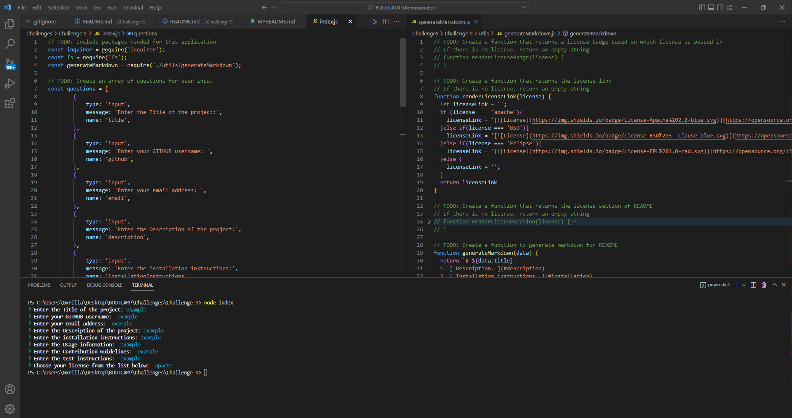

# Challange 9 README Generator
The challenge required students to create a command line application to generate a readme  generator for an app developer. 

The file consists of a utils folder which hast he generateMarkdown.js file and the main folder contains the rest of the json packages aswell as the index.js file which the application that is launched through node.

  Contents:
    - JavaScipt
    - Inquirer
    - FS

The file should be accessable from the https link: <https://github.com/RyanZade/Challenge-9>

RyanZade